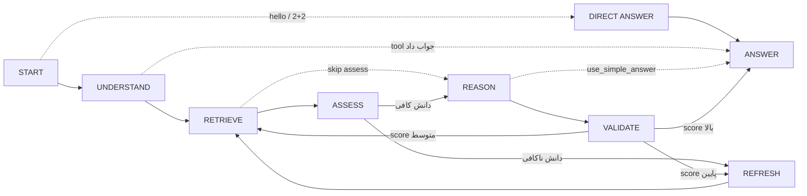

# معماری فلوی اجرا — راهنمای خواندن و تغییر کد

این سند مسیر کامل یک پرامپت از ورود تا پاسخ را با واژگان LangGraph/LangChain
توضیح می‌دهد تا بدانید هر مفهوم کجای کد است و چطور تغییرش دهید.

## نقشه‌ی گراف

## نگاشت مفاهیم LangGraph → این پروژه

| مفهوم LangGraph | این‌جا | فایل |
|---|---|---|
| `State` | `AgentState` — همه‌ی داده‌ی جاری فلو | `agents/state.py` |
| `Node` | متدهای `_step_*` (جدول `_STEP_HANDLERS`) | `agents/adaptive_orchestrator.py` |
| `Conditional Edge` | مقدار بازگشتی هر `_step_*` (گره‌ی بعدی) | همان‌جا |
| تعریف یال‌های مجاز | `self._transitions` | همان‌جا |
| `compile().invoke()` | `run()` → `_execute_dynamic_plan()` | همان‌جا |
| `recursion_limit` | `DynamicPlan.max_iterations` | همان‌جا |
| `Checkpointer` | `FlowSessionStore` (ذخیره‌ی هر اجرا در JSONL) | `core/session_store.py` |
| `Tool` / `@tool` | `TOOL_REGISTRY` (منوی planner) + skill registry (اجرا) | `llm/tool_registry.py`, `agents/skill_executor.py` |
| نمایش گراف | tab «🔀 Flow» + نوار زنده‌ی چت | `api/flow_visualizer.py` |

## گره‌ها (Nodes)

| گره | متد | کارش | مدل درگیر |
|---|---|---|---|
| SHORTCUT | `_try_shortcut` | سلام/محاسبه → پاسخ مستقیم بدون RAG | granite (یا هیچ) |
| UNDERSTAND | `_step_understand_and_analyze` | طبقه‌بندی + برنامه‌ریزی + tool calls | phi3 (برای کوئری ساده skip می‌شود) |
| RETRIEVE | `_step_retrieve` | جستجوی هیبریدی Weaviate + گراف Kuzu | Qwen3-Embedding |
| ASSESS | `_step_assess` | «دانش کافی است؟» (آستانه‌ی confidence) | phi3 (gap detection) |
| REFRESH | `_step_refresh` | ویکی‌پدیا/RSS → chunk → embed → ingest | Qwen3 + GLiNER |
| REASON | `_step_reason` | استدلال و تولید پاسخ با citations | granite |
| VALIDATE | `_step_validate` | امتیازدهی پاسخ و تصمیم چرخه‌ی بعد | — |

- **کوئری از کجا وارد می‌شود:** `main_adaptive.py: chatbot()` → فایل‌ها به skill های
  media می‌روند، متن به `GLOBAL_ADAPTIVE_ORCH.run()`.
- **plan داینامیک:** `_generate_dynamic_plan()` بر اساس نوع کوئری تعیین می‌کند
  کدام گره‌ها لازم‌اند، کدام skip شوند و سقف چرخه چند است.
- **حلقه‌ی اجرا:** `_execute_dynamic_plan()` — تا رسیدن به ANSWER/ERROR گره‌ی
  جاری را اجرا و خروجی‌اش را به‌عنوان گره‌ی بعدی دنبال می‌کند؛ برگشتن به
  گره‌ی قبلاً اجراشده = یک چرخه (`state.iteration`).

## مدیریت مدل‌ها

- همه‌ی لودها از **ModelGate** می‌گذرند (`core/model_gate.py`) — حالت
  `serial` (پیش‌فرض، یک مدل سنگین همزمان) یا `concurrent`؛ کانفیگ در بلاک
  `model_execution` در `configs/main_config.py` یا env `MODEL_EXECUTION_MODE`.
- مسیر مدل‌ها: اول `models/<name>` لوکال، بعد fallback (`core/model_paths.py`).
- کاتالوگ همه‌ی مدل‌های لوکال و قابلیت‌ها: `configs/model_catalog.py`
  (skill «list_local_models» همین را به planner می‌دهد).

## «فرایند فکر» (thinking)

- توکن‌های فکر مدل‌ها (`<think>…</think>`، `REASONING:`) با
  `llm/thinking.py: split_thinking()` از پاسخ جدا می‌شوند.
- orchestrator تصمیم‌هایش را با `_think()` در `state.thinking_log` می‌نویسد
  (طبقه‌بندی، برنامه، میان‌بر، فکر مدل).
- چت این‌ها را زنده استریم می‌کند: `api/thinking_view.py: compose_thinking()`
  → حباب «🧠 فرایند فکر» در `main_adaptive.py: chatbot()`.

## چطور چیز جدید اضافه کنم؟

**گره‌ی جدید به فلو:**
1. مقدار جدید به `FlowStep` در `agents/state.py`
2. متد `async def _step_<name>(self, state, plan) -> FlowStep` بنویسید
3. به `_STEP_HANDLERS` و `_transitions` اضافه کنید
4. برای نمایش: گره و یال‌ها را به `_NODES`/`_EDGES` در
   `api/flow_visualizer.py` اضافه کنید

**Skill/Tool جدید:**
1. تابع skill (sync یا async) در `agents/*_skills.py` + ثبت در dict مربوطه
2. اگر planner باید بتواند انتخابش کند: `@register_tool` در
   `llm/tool_registry.py`

**مدل جدید:**
1. پوشه/فایل مدل را در `models/` بگذارید
2. ورودی کاتالوگ در `configs/model_catalog.py`
3. اگر LLM است و باید با بقیه سری/موازی شود: لودش را از
   `get_model_gate().acquire(...)` عبور دهید

## کوئری کجا ذخیره می‌شود؟

هر اجرا (query، پاسخ، trace گره‌ها، زمان‌ها) یک خط JSON در
`data/sessions/flow_history.jsonl` — بعد از restart در tab «Flow» قابل مرور
است و با دکمه‌ی Export به JSON+SVG خروجی می‌گیرد.
